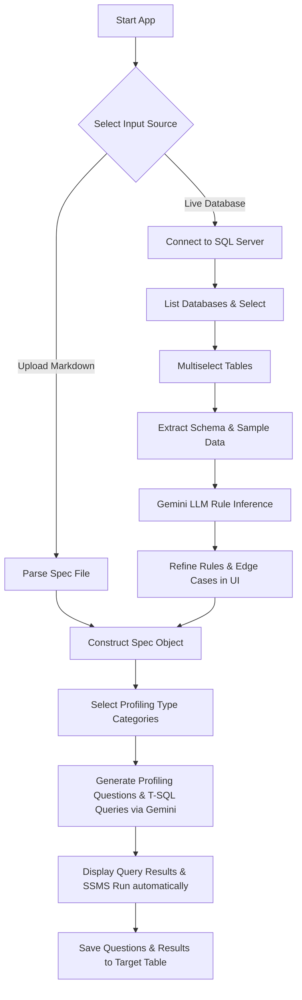

# Data Profiler 📊

Data Profiler is an automated data quality and profiling tool designed to connect to your live SQL Server instance, extract database schemas, infer business rules and edge cases from data samples using Gemini LLM, generate diagnostics T-SQL queries, and automatically execute them to monitor data quality.

---

## 🔄 Workflow

Data Profiler follows a modular pipeline from schema analysis to rule refinement and profiling execution:



---

## ✨ Key Features

1. **Live Schema Extraction**: Automatically retrieves schemas, columns, nullability, primary keys, and foreign keys from the selected database on the server.
2. **Data-Driven Rule Inference**: Pulls sample rows (top 5) and row counts for selected tables to help Gemini auto-infer potential business rules and data anomalies.
3. **Advanced Type Support**: Gracefully formats complex/unsupported SQL Server types:
   - Spatial types (`geography`, `geometry`, `hierarchyid`) are converted to WKT strings via `.ToString()`.
   - Binary types (`varbinary`, `image`) are safely masked to prevent `pyodbc` data binding issues.
4. **Enterprise Privacy Mode**: Toggleable **Privacy Mode** to exclude querying or sending any actual data rows to the cloud API, relying strictly on structural metadata.
5. **SQL Security Guard**: Prevents dangerous write/modify operations (`INSERT`, `UPDATE`, `DELETE`, `DROP`, `ALTER`, `TRUNCATE`, etc.) from running during automatic diagnostic execution.
6. **Automatic Query Execution**: Runs generated queries on the fly when expanding the question details dropdown. It displays the live results in a tabular view (up to 100 rows) or alerts with **"0 rows returned"** when no issues are found.

---

## 🛠️ Project Structure

```
data-profiler/
├── app.py                  # Streamlit entry point and UI layout
├── requirements.txt        # Project dependencies
├── run.bat                 # Windows shell startup script
├── sample_schema.md        # Bundled markdown database spec sample
├── src/
│   ├── __init__.py
│   ├── gemini_client.py    # Direct client wrapper for google-genai
│   ├── llm.py              # LLM inference routing module
│   ├── markdown_parser.py  # Markdown specification parsing engine
│   ├── profiler.py         # Profiling generation prompts and inference functions
│   ├── profiling_types.py  # Definitions for different profiling metrics
│   └── sql_server.py       # SQL Server reader, writer, and executor
└── scripts/                # Diagnostic utility scripts
```

---

## 🚀 Getting Started

### Prerequisites

- Python 3.10+
- SQL Server (e.g. LocalDB, SQLEXPRESS, or Server instance)
- ODBC Driver 17 or 18 for SQL Server installed on host machine

### Installation

1. Clone or download the repository to your projects workspace.
2. Setup the virtual environment and install dependencies:
   ```powershell
   python -m venv .venv
   .venv\Scripts\activate.bat
   pip install -r requirements.txt
   ```

### Configuration

Create a `.env` file in the root folder (or rename `.env.example`) and fill in your keys and environment configurations:

```env
GOOGLE_API_KEY=your_gemini_api_key_here
GEMINI_MODEL=gemini-2.5-flash
GEMINI_TEMPERATURE=0.2

# Default SQL Server Settings
SQL_SERVER=localhost\SQLEXPRESS
SQL_DATABASE=InventoryAndOrderManagament
PROFILING_TABLE=dbo.DataProfilingQuestions
```

### Running the App

Run the startup batch script or run Streamlit directly from your terminal:

```powershell
.\run.bat
```
*(or)*
```powershell
.venv\Scripts\streamlit.exe run app.py
```

Open **[http://localhost:8501](http://localhost:8501)** in your browser.

---

## 📊 Usage Guide

1. **Configure Connection**: Enter server, driver, authentication mode in the sidebar, then select your database from the dynamic dropdown.
2. **Schema Source selection**: Select **Extract from Live SQL Server Database** and pick target tables to profile.
3. **Analyze**: (Optional: Toggle **Privacy Mode** if database contains sensitive PII). Click **Analyze Schema & Sample Data** to retrieve metadata and infer rules.
4. **Refine**: Edit or declare custom rules/edge cases directly in the provided text areas.
5. **Select Categories**: Check which categories you want to profile (Completeness, Business Rules, Edge Cases, etc.).
6. **Generate**: Click **Generate profiling questions** to invoke Gemini to construct SSMS-ready T-SQL queries.
7. **Verify & Save**: Expand questions to automatically run the query and view results, then save the list to your configured target logging table.
